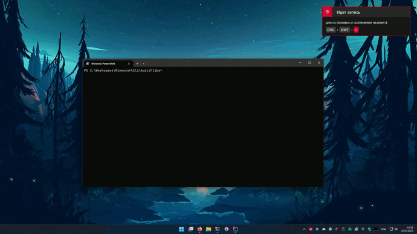

# MinecraftCli ✅
[LICENSE](https://github.com/TeamLeak/UnitedMinecraftStates./blob/master/LICENSE) & [WIKI](https://github.com/TeamLeak/UnitedMinecraftStates./wiki)

Well, this is my project that will **allow the launcher not to bother with the launch of the fucking minecraft.**

## How it works. 💀💀💀
In fact, **everything is as simple as possible here - I don't know why this wasn't done earlier.** 
I just **build a launcher with all the necessary libraries**, as well as an applet that allows you to **load DLL files into CLASSPATH**, 
after which I **call the main method** from my JAVA program.



## Usage. 💖

*For tests*, **download the release** from releases and **run using**:
```
java -jar MinecraftCli.jar --version 1.16.5 --accessToken null --username Leanfe 
```

### Building.
1. Cloning the repository.
2. Clean your .minecraft folder from everything that is there except the launcher and download the version you need.
    For example, **Forge** 1.16.5.
3. **Depending on your platform**, run the necessary PRE-BUILD script.
4. Launch the game through the launcher, freeze the process after downloading and **copy natives from the versions' folder to natives folder in this project.**

5. Now that **you have NATIVES for your platform and libraries**, we assemble this project and copy the JAR file to any convenient folder, along with the natives' folder.

### Deploy.
**I want to note that natives is different for each platform**, so you will most likely have to raise Linux/WSL if you want to make the project cross-platform.

Well, now, **your task is to upload these files to the server**, after which the **task of your launcher will be reduced to downloading the mods, maps, ... and the assembled JAR file**, after which the JAR file will be **launched** with the transfer of **accessToken, version** and other fields. (username, server, etc.)

### 🦷🦷🦷